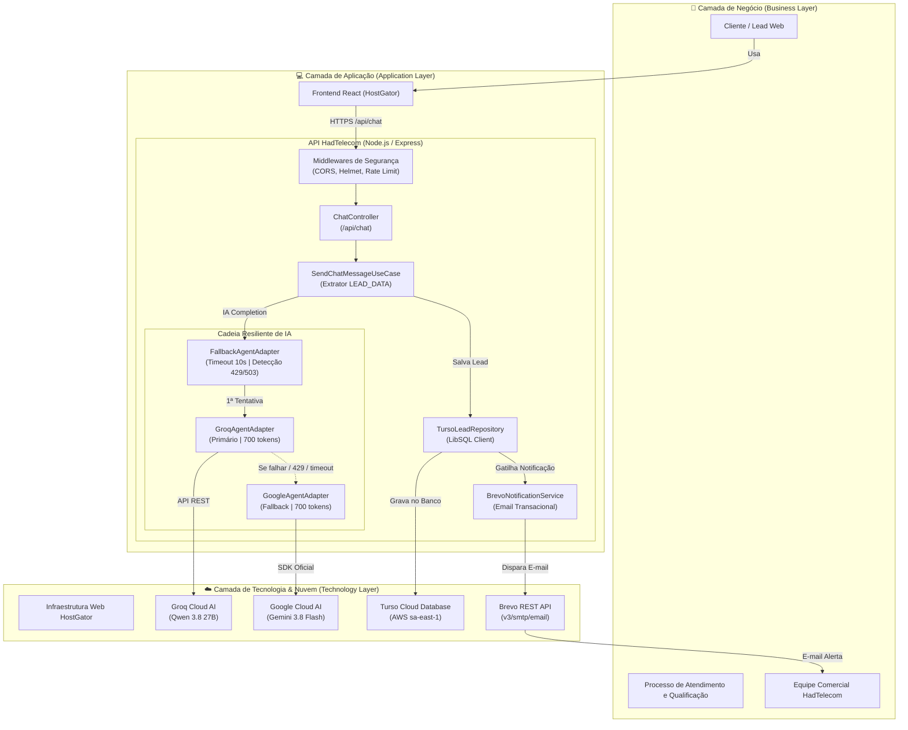

# Arquitetura da Solução — API HadTelecom

Este projeto possui a modelagem arquitetural formal conforme os padrões do **The Open Group ArchiMate 3.1**, pronta para importação e visualização em ferramentas de modelagem corporativa (como o [Archi](https://www.archimatetool.com/), Visual Paradigm, Enterprise Architect e BiZZdesign).

---

## 📁 Arquivos ArchiMate Gerados

1. **[architecture.archimate](file:///d:/desenv/api-hadtelecom/architecture.archimate)**:
   - Formato nativo do **Archi** (versões 4 e 5).
   - Contém a árvore completa de pastas (*Business, Application, Technology, Motivation, Relations, Views*) com o diagrama visual já diagramado e posicionado.
   - **Como abrir**: Basta abrir o software Archi e clicar em `File -> Open` (ou dar duplo clique no arquivo).

2. **[architecture_exchange.xml](file:///d:/desenv/api-hadtelecom/architecture_exchange.xml)**:
   - Formato padrão internacional **The Open Group ArchiMate Model Exchange File Format (ArchiMate 3.1)**.
   - **Como abrir**: No Archi ou em qualquer ferramenta de modelagem, use a opção `File -> Import -> Model from Open Exchange File...`.

---

## 🏛️ Visão Geral em Camadas (ArchiMate Viewpoint)

---

## 🔍 Detalhamento das Camadas

### 1. Camada de Negócio (Business Layer)
- **Cliente / Visitante**: Consome o autoatendimento no site buscando planos de fibra e links dedicados.
- **Processo de Atendimento**: Conversação natural que qualifica o lead e coleta dados de contato.
- **Equipe Comercial**: Recebe o e-mail de alerta em tempo real contendo nome, e-mail, whatsapp e necessidade do cliente.

### 2. Camada de Aplicação (Application Layer)
- **SendChatMessageUseCase**: Orquestrador que gera a resposta consultiva e detecta o bloco `<<<LEAD_DATA>>>`.
- **FallbackAgentAdapter**: Garante alta disponibilidade. Se o provedor principal demorar mais de 10s (`AI_TIMEOUT_MS`) ou retornar erro de limite (`429`) ou sobrecarga (`503`), comuta instantaneamente para o Gemini.
- **TursoLeadRepository**: Persiste o lead com schema auto-migrável e aciona o serviço de notificação.
- **BrevoNotificationService**: Monta a notificação e consome a API da Brevo de forma não-bloqueante.

### 3. Camada de Tecnologia (Technology Layer)
- **Groq Cloud API**: Modelo `qwen/qwen3.8-27b` com limite de 700 tokens.
- **Google Gemini API**: Modelo `gemini-3.8-flash` com limite de 700 tokens.
- **Turso LibSQL**: Cluster de banco de dados distribuído no Brasil (`aws-sa-east-1`).
- **Brevo API**: Serviço SMTP transacional disparando para `ailson.costa@hadtelecom.net.br`.
